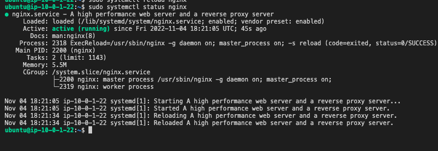
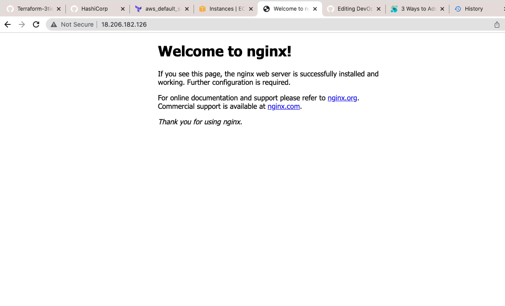
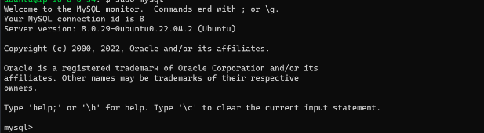
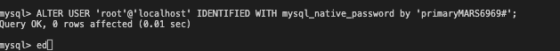
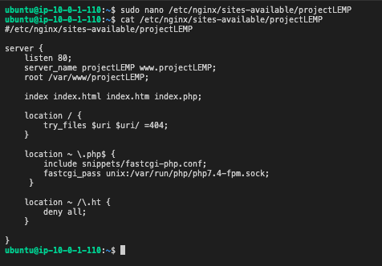
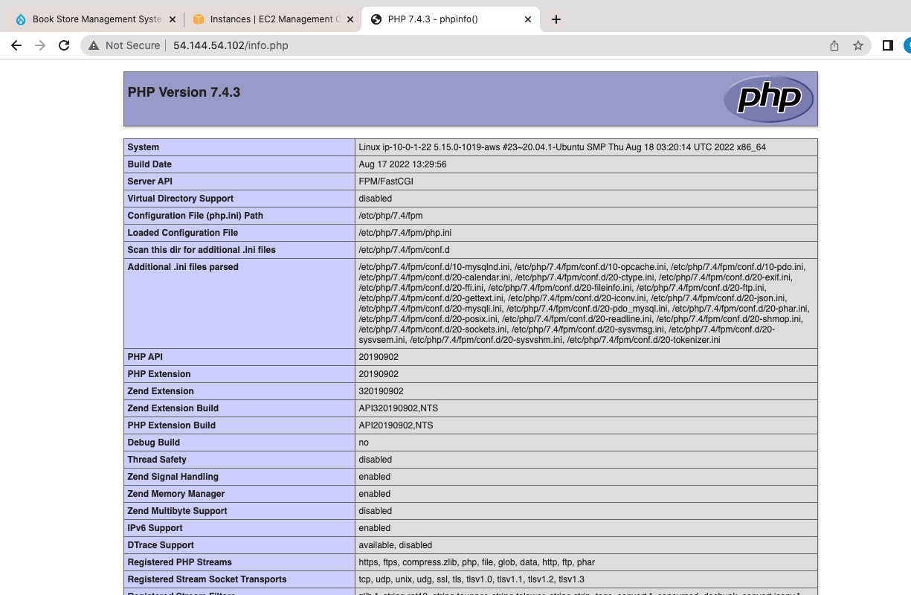
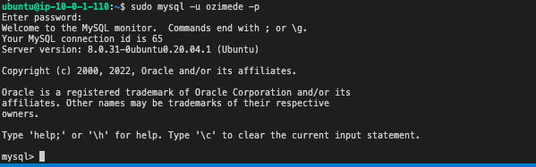
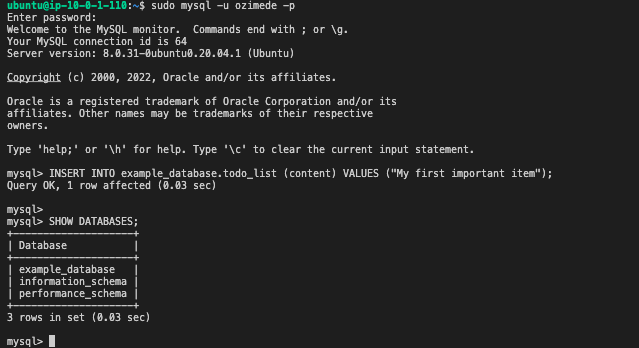
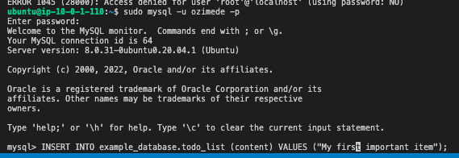
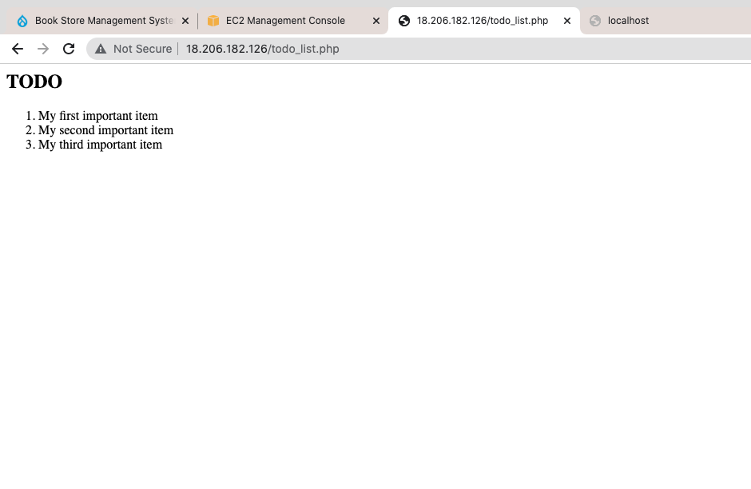

## WEB STACK IMPLEMENTATION (LEMP STACK)
---
### STEP 1 – INSTALLING THE NGINX WEB SERVER
#### Steps
* To start, update server’s package index. Afterwards, use apt install to get the Nginx installation going. To start the update run: **Sudo apt update**
* Next, install Nginx by running: **sudo apt install nginx**
* At the prompt, enter Y to confirm that you want to install Nginx. This would complete the installation process.
* To confirm that nginx was successfully installed and is running as a service in Ubuntu, run: **sudo systemctl status nginx**


* Green indicator shows that the server was successfully install and running.


* The server is running and we can access it locally and from the Internet but to access it from the internet port 80 must be open to allow traffic from the internet in.
* To test that the server can be accessed locally from the instance run the curl command: **curl http://localhost:80** The output shows that the server is accessible from the local host.

* To test that the server can be accessed from the internet, open a browser and type the following url with the public IP of your Ubuntu instance; 
**http://Public-IP-Address:80**


### STEP 2 — INSTALLING MYSQL
#### Steps
* To acquire and install SQL run: **sudo apt install mysql-server** in the terminal.
* At the prompt, confirm installation by typing Y and enter to proceed.
* Next, log into MySQL: **sudo mysql**


* Run a security script that comes pre-installed with MySQL. This script will remove some insecure default settings and lock down access to your database system. run the follwing command: **ALTER USER 'root'@'localhost' IDENTIFIED WITH mysql_native_password BY 'PassWord.1';**


* Exit SQL shell by typing **exit** 
* Start interactive scripting to configure the validate password pluggin. Run: **sudo mysql_secure_installation** and answer Y to all the prompts. At the point you can change the password of your root user and also decide the level of password validation.
* When done, test to know if login to the console is possible. type: **sudo mysql -p** 


* This would prompt you to enter root user password. Enter the choosen password and enter.
* type exit to exit MySQL console.


### STEP 3 – INSTALLING PHP
#### Steps
* PHP has to be installed to process code and generate dynamic content for the web server.
* Nginx requires an external program to handle PHP processing and act as a bridge between the PHP interpreter itself and the web server. This allows for a better overall performance in most PHP-based websites, but it requires additional configuration. You’ll need to install php-fpm, which stands for “PHP fastCGI process manager”, and tell Nginx to pass PHP requests to this software for processing. Additionally, you’ll need php-mysql, a PHP module that allows PHP to communicate with MySQL-based databases. Core PHP packages will automatically be installed as dependencies.
* To install the 2 pacakages at once, run: 
** sudo apt install php-fpm php-mysql **
* Type Y to confirm installation and enter.


### STEP 4 — CONFIGURING NGINX TO USE PHP PROCESSOR
#### Steps
* Now that we have PHP components installed. Next, I will configure Nginx to use them.
* Create the root web directory for your_domain as follows:**sudo mkdir /var/www/projectLEMP**


* Next, assign ownership of the directory with the $USER environment variable, which will reference your current system user: **sudo chown -R $USER:$USER /var/www/projectLEMP**
* Then, open a new configuration file in Nginx’s sites-available directory using your preferred command-line editor. Here, we’ll use nano: **sudo nano /etc/nginx/sites-available/projectLEMP**
* This will create a new blank file. Paste in the following bare-bones configuration:
```
server {
    listen 80;
    server_name projectLEMP www.projectLEMP;
    root /var/www/projectLEMP;

    index index.html index.htm index.php;

    location / {
        try_files $uri $uri/ =404;
    }

    location ~ \.php$ {
        include snippets/fastcgi-php.conf;
        fastcgi_pass unix:/var/run/php/php8.1-fpm.sock;
     }

    location ~ /\.ht {
        deny all;
    }
}
```


* In the namo editor, enter CTRL+X to exit and Y to confirm.
* Activate the configuration by linking to the config file from Nginx’s sites-enabled directory, run: **sudo ln -s /etc/nginx/sites-available/projectLEMP /etc/nginx/sites-enabled/**
* test your configuration for syntax errors by typing: **sudo nginx -t**


* We need to disable default Nginx host that is currently configured to listen on port 80, for this run: **sudo unlink /etc/nginx/sites-enabled/default**
* Next, reload Nginx to apply the changes: **sudo systemctl reload nginx**


* The website is now active, but the web root /var/www/projectLEMP is still empty. Create an index.html file in that location so that we can test that the new server block works as expected: **sudo echo 'Hello LEMP from hostname' $(curl -s http://169.254.169.254/latest/meta-data/public-hostname) 'with public IP' $(curl -s http://169.254.169.254/latest/meta-data/public-ipv4) > /var/www/projectLEMP/index.html**
* Open a browser and try to open the website URL using IP address: **http://Public-IP-Address:80**
!

### STEP 5 – TESTING PHP WITH NGINX
#### Steps
* Now that LAMP stack is completely installed and fully operational. We test it to validate that Nginx can correctly hand .php files off to your PHP processor.
* Open a new file called info.php within your document root in your text editor: **sudo nano /var/www/projectLEMP/info.php**
* Type the following lines into the new file.
```
<?php
phpinfo();
```
* You can now access this page in your web browser by visiting the domain name or public IP address you’ve set up in your Nginx configuration file, followed by /info.php: **http://`server_domain_or_IP`/info.php**


Remove the created file, as it contains sensitive information about your PHP environment and your Ubuntu server: **sudo rm /var/www/your_domain/info.php**


### STEP 6 – RETRIEVING DATA FROM MYSQL DATABASE WITH PHP (CONTINUED)
#### Steps
* The goal in this step is to create a test database (DB) with simple "To do list" and configure access to it, so the Nginx website would be able to query data from the DB and display it.
* Because the native MySQL PHP library mysqlnd currently doesn’t support caching_sha2_authentication, the default authentication method for MySQL 8. We’ll need to create a new user with the mysql_native_password authentication method in order to be able to connect to the MySQL database from PHP.
* I will be creating a database named example_database and a user named example_user.
* Connect to the MySQL console using the root account: **sudo mysql**


* To create a new database, run the following command from your MySQL console: **CREATE DATABASE `example_database`;**


* Next, create a new user and grant him full privileges on the database. The following command creates a new user named example_user, using mysql_native_password as default authentication method. Run: **CREATE USER 'example_user'@'%' IDENTIFIED WITH mysql_native_password BY 'PassWord1@';**


* Next, give this user permission over the example_database database: **GRANT ALL ON example_database.* TO 'example_user'@'%';**
* This will give the example_user user full privileges over the example_database database, while preventing this user from creating or modifying other databases on your server.
* Exit the console: **exit**
* Now test if the new user has the proper permissions by logging in to the MySQL console again, this time using the custom user credentials: **mysql -u example_user -p**


* After logging in to the MySQL console, confirm that you have access to the example_database database: **SHOW DATABASES;**


* Next, we’ll create a test table named todo_list. From the MySQL console, run the following statement:
``` 
CREATE TABLE example_database.todo_list (
item_id INT AUTO_INCREMENT,
content VARCHAR(255),
PRIMARY KEY(item_id)
);


#CREATE db.sql file 
sudo vi db.sql 

#Copy and Paste this script into vi editor 


#SAVE FILE - Hit the ESC and input wq and enter to save and quit 


#IMPORT DB into database 
mysql -u user -p  example_database </home/ubuntu/db.sql
```

* Insert a few rows of content in the test table. Repeat the next command a few times, using different VALUES: **INSERT INTO example_database.todo_list (content) VALUES ("My first important item");**


* To confirm that the data was successfully saved to your table, run: **SELECT * FROM example_database.todo_list;**


* After confirming, exit the console: **exit**
* Next, create a PHP script that will connect to MySQL and query for your content. Create a new PHP file in your custom web root directory using your preferred editor. We’ll use vi for that: **nano /var/www/projectLEMP/todo_list.php**
* Copy this content into your todo_list.php script:
```
<?php
$user = "example_user";
$password = "password";
$database = "example_database";
$table = "todo_list";

try {
  $db = new PDO("mysql:host=localhost;dbname=$database", $user, $password);
  echo "<h2>TODO</h2><ol>";
  foreach($db->query("SELECT content FROM $table") as $row) {
    echo "<li>" . $row['content'] . "</li>";
  }
  echo "</ol>";
} catch (PDOException $e) {
    print "Error!: " . $e->getMessage() . "<br/>";
    die();
}
```


* Save and close the file when you are done editing.
* Access this page in the web browser by visiting the domain name or public IP address configured for the website, followed by /todo_list.php: **http://<Public_domain_or_IP>/todo_list.php**



##ATTENTION!!
### Issues
While everything seemed to on go smoothly during the project, I however encountered an issue when I got to the final step where I had to access the database from the internet through the browser. I got an error saying: **Error!: SQLSTATE[HY000] [1045] Access denied for user 'example_user'@'localhost' (using password: YES)**

After several attempts at troubleshooting the issue, I realized that I had not changed the password value in the PHP script to the new password that I created when I created the example_user.
